# AI Project Portfolio

A curated portfolio of AI-assisted software projects, product prototypes, workflow systems, and research artifacts. This repository is organized to show complete runnable applications alongside employer-facing documentation, case studies, and structured concept work.


[](https://github.com/atomicdjt/AI-Project-Portfolio/actions/workflows/ci.yml)

## Fast Review Links

- [Public Portfolio Hub](https://atomicdjt.github.io/AI-Project-Portfolio/)
- [Recruiter Quick Review](docs/recruiter-quick-review.md)
- [Verification Guide](docs/verification.md)
- [Technical Depth](docs/technical-depth.md)
- [Skills Matrix](docs/SKILLS_MATRIX.md)
- [Employer Overview](docs/EMPLOYER_OVERVIEW.md)
- [Project Index](docs/PROJECT_INDEX.md)
- [Deployment and Preview Map](docs/deployment-and-previews.md)
- [Public Portfolio Audit - July 4, 2026](docs/public-portfolio-audit-2026-07-04.md)

## Start Here for Recruiters and Hiring Managers

This portfolio is designed to be reviewed quickly. The strongest evidence is concentrated in the public portfolio hub, eleven runnable app workspaces, live demos, and employer-facing case studies that explain the product thinking behind each build.

**Best review path:**

1. Start with the **[Public Portfolio Hub](https://atomicdjt.github.io/AI-Project-Portfolio/)** for the 3-minute review path and live demo links.
2. Review **[BuildWorld AI](apps/buildworld-ai)** and its **[live demo](https://buildworld-ai.netlify.app/)** for the most technically ambitious simulation, data-visualization, and product-architecture project.
3. Review **[RedactReady Pro](apps/redactready-pro-hri-os)** and its **[live demo](https://redactready-pro-hri-os.netlify.app/)** for the flagship privacy/document intelligence product.
4. Review **[ScamShield AI](apps/scamshield-ai)** and its **[live demo](https://scamshield-ai-safety.netlify.app/)** for a complete public-interest cybersecurity workflow and live deployment.
5. Review **[RedactReady](apps/redactready-local)** and its **[live demo](https://redactready-local.netlify.app/)** for deeper privacy/security document redaction mechanics.
6. Review **[LayerForge Studio](apps/layerforge-studio)** for frontend and Canvas-based application polish.
7. Review **[OpsPilot](apps/opspilot-ai-operations-toolkit)** and its **[live demo](https://opspilot-ai-operations-toolkit.netlify.app/)** for the clearest connection to operations, documentation, onboarding, and knowledge-management roles.
8. Review **[FocusForge](apps/focusforge)** and its **[live demo](https://focusforge-productivity-game.netlify.app/)** for a polished gamified productivity app with local persistence, progression systems, and a deployable static architecture.
9. Review **[VariantVision Pro](apps/variantvision-pro)** and its **[live demo](https://variantvisionpro.netlify.app/)** for complex-domain research-tool implementation, source transparency, and non-diagnostic evidence review.
10. Skim the **[Employer Overview](docs/EMPLOYER_OVERVIEW.md)**, **[Project Index](docs/PROJECT_INDEX.md)**, and **[Skills Matrix](docs/SKILLS_MATRIX.md)** to connect the work to role requirements.

This repository is not presented as a claim of senior engineering experience. It is presented as evidence of practical initiative, AI-assisted execution, product judgment, documentation discipline, and the ability to turn ambiguous ideas into structured working systems.

## Role Fit

| Target Role | Why This Portfolio Fits |
| --- | --- |
| **Technical Operations** | Demonstrates workflow analysis, SOP generation, documentation structure, process improvement, and practical tool-building for operational clarity. |
| **AI Workflow Specialist** | Shows applied AI product thinking across support triage, knowledge operations, redaction workflows, research tooling, and user-facing AI interfaces. |
| **Documentation Coordinator / Knowledge Base Coordinator** | Includes structured case studies, employer-facing guides, project indexing, knowledge base concepts, training checklists, and review-ready documentation. |
| **Product Operations** | Shows the ability to define user problems, build MVP workflows, document tradeoffs, prioritize scope, and package products for stakeholder review. |

## Portfolio Snapshot

This portfolio is strongest when read as evidence of:

- AI-assisted product prototyping and workflow design.
- Frontend application development with React, TypeScript, Vite, Express, Canvas 2D, and local persistence.
- Privacy-first product design, local-only processing, and responsible safety limitations.
- Technical operations thinking across support triage, documentation systems, knowledge management, and process improvement.
- Research synthesis and structured analysis across bioinformatics, cognitive frameworks, and educational tools.
- Employer-facing documentation, scope control, and responsible-use framing.

## Featured Applications

| Project | Review Link | Demo Status | Screenshot | Value Pitch |
| --- | --- | --- | --- | --- |
| **[Portfolio Hub](apps/portfolio-hub)** | [Recruiter Guide](docs/recruiter-quick-review.md) | [Live Hub](https://atomicdjt.github.io/AI-Project-Portfolio/) / Local `5180` | Uses portfolio screenshots from `docs/images/` | The portfolio hub is the fastest employer-facing entry point: a public, responsive review surface with the best three projects, live demo links, source/case-study links, status labels, and a comparison table. |
| **[BuildWorld AI](apps/buildworld-ai)** | [Case Study](projects/buildworld-ai/CASE_STUDY.md) | [Live Demo](https://buildworld-ai.netlify.app/) / Local `5183` | 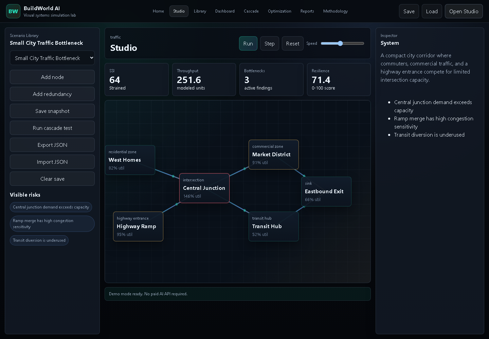 | BuildWorld AI is the most technically ambitious flagship: a visual graph-based systems simulation lab with deterministic engines, editable canvas, SSI stability scoring, cascade analysis, optimization suggestions, scenario comparison, local persistence, and exportable reports. |
| **[RedactReady Pro](apps/redactready-pro-hri-os)** | [Case Study](projects/redactready-pro-hri-os/CASE_STUDY.md) | [Live Demo](https://redactready-pro-hri-os.netlify.app/) / Local `5181` | 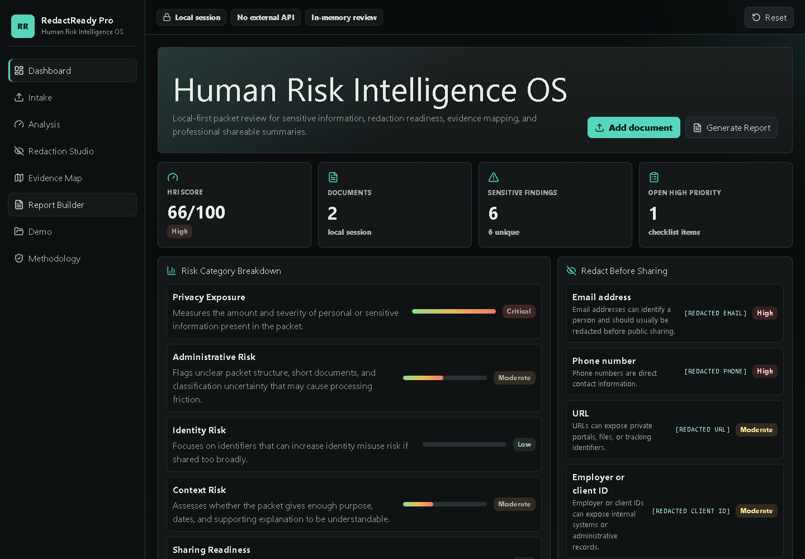 | RedactReady Pro / Human Risk Intelligence OS is the flagship privacy product: a local-first document intelligence platform for sensitive-information detection, HRI scoring, evidence mapping, action planning, redaction, and report export. It demonstrates product architecture, privacy engineering, deterministic analysis, polished UX, and deployment readiness. |
| **[ScamShield AI](apps/scamshield-ai)** | [Case Study](projects/scamshield-ai/CASE_STUDY.md) | [Live Demo](https://scamshield-ai-safety.netlify.app/) / Local `5178` | 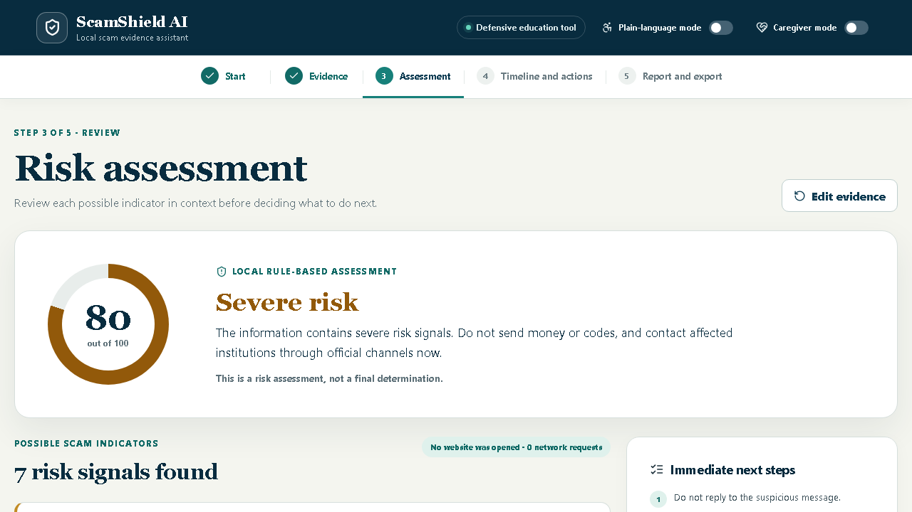 | ScamShield AI is a local-first consumer-protection workflow for assessing suspicious messages, preserving evidence, building a timeline, choosing safer next steps, locating official reporting channels, and exporting a structured PDF packet. It demonstrates accessible safety UX, deterministic explainable analysis, privacy-first architecture, and production deployment. |
| **[RedactReady](apps/redactready-local)** | [Case Study](projects/redactready-local/CASE_STUDY.md) | [Live Demo](https://redactready-local.netlify.app/) / Local `5173` | 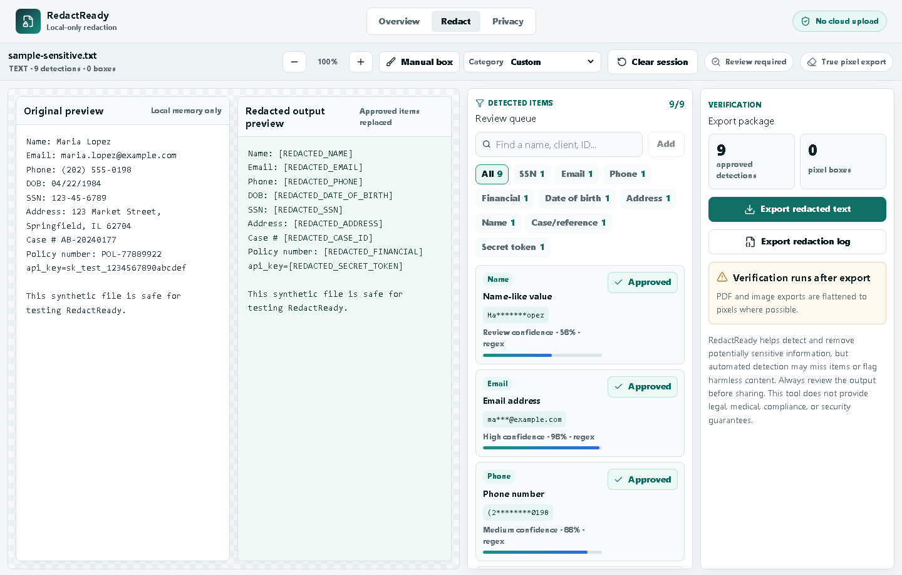 | RedactReady is the strongest privacy/security product in the portfolio: a local-first redaction MVP for PDFs, images, TXT, and CSV files with detector review, manual redaction boxes, flattened exports, and verification reporting. It demonstrates product judgment around sensitive documents, responsible UX, and practical threat-model boundaries. |
| **[OpsPilot](apps/opspilot-ai-operations-toolkit)** | [Case Study](projects/opspilot-ai-operations-toolkit/CASE_STUDY.md) | [Live Demo](https://opspilot-ai-operations-toolkit.netlify.app/) / Local `5177` |  | OpsPilot is an AI operations toolkit that turns rough notes, policies, tickets, and FAQs into SOPs, onboarding checklists, knowledge base articles, gap reports, and versioned documentation. It is the clearest bridge between this portfolio and technical operations, enablement, documentation, and knowledge-management roles. |
| **[FocusForge](apps/focusforge)** | [Case Study](projects/focusforge/CASE_STUDY.md) | [Live Demo](https://focusforge-productivity-game.netlify.app/) / Local `5179` | 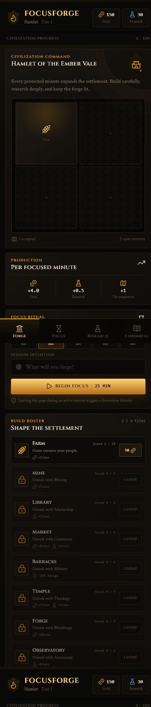 | FocusForge is a local-first gamified productivity app that turns uninterrupted focus sessions into civilization growth, research unlocks, streaks, activity history, and exportable local progress. It demonstrates product-system design, persistent client state, responsive UX polish, and static deployment readiness. |
| **[VariantVision Pro](apps/variantvision-pro)** | [Case Study](projects/variantvision-pro/CASE_STUDY.md) | [Live Demo](https://variantvisionpro.netlify.app/) / Local `5182` | 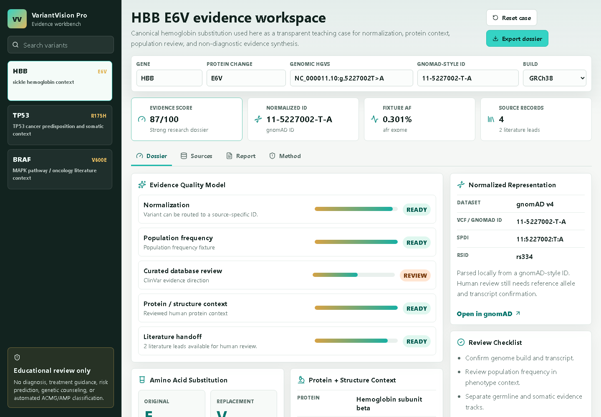 | VariantVision Pro is a live bioinformatics evidence workbench for educational variant review, source transparency, amino-acid comparison, evidence-quality scoring, and non-diagnostic report export. It demonstrates complex-domain product architecture and responsible research-tool UX. |
| **[Astra](apps/astra)** | [Case Study](projects/astra/CASE_STUDY.md) | Local `5174` with Express API `3002` | 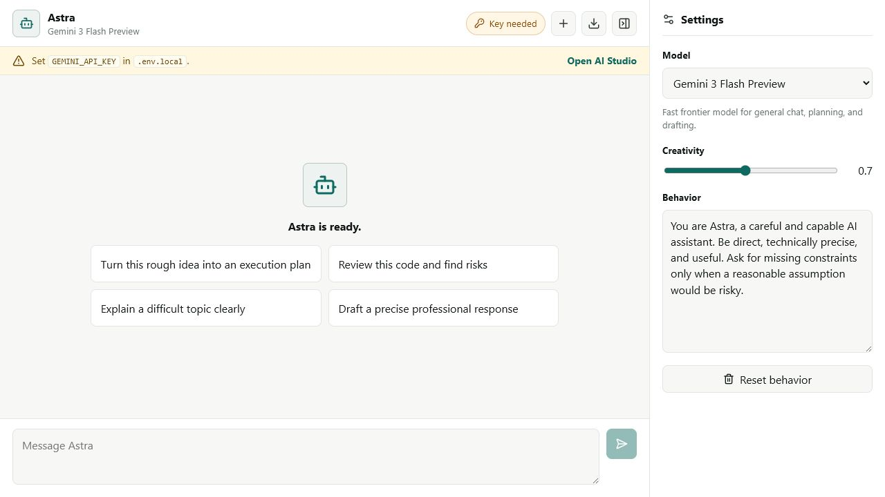 | Astra is a local AI chat workspace that demonstrates a practical AI application pattern: React frontend, Express API layer, streaming response workflow, Markdown rendering, model configuration, transcript export, and visible API-key status handling. It shows the ability to build a credible AI interface beyond a thin API wrapper. |
| **[Nexus Play](apps/nexus-play)** | [Case Study](projects/nexus-play/CASE_STUDY.md) | Local `5175` with Express API `3003` | 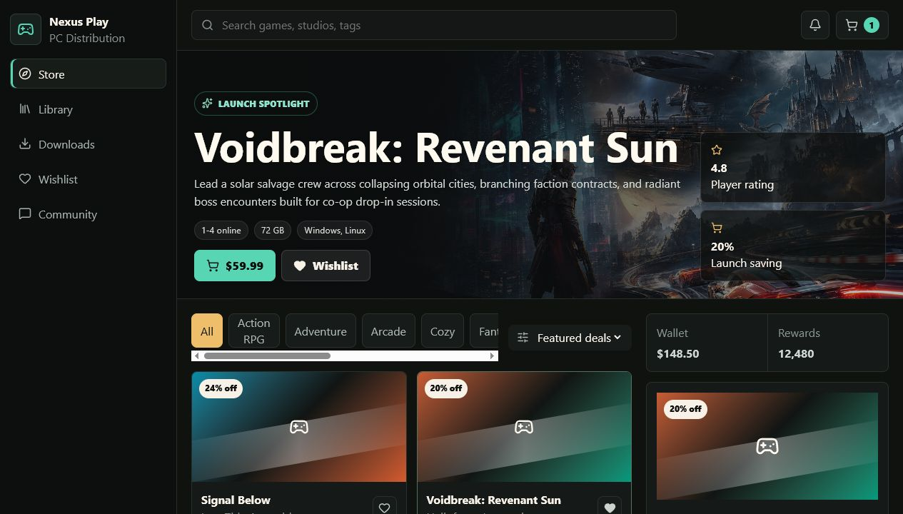 | Nexus Play is a digital game distribution platform demo with storefront browsing, catalog interaction, wishlist, cart, simulated checkout, owned library state, and install queue concepts. It demonstrates product UI thinking, user-state design, and platform-style workflow modeling. |
| **[LayerForge Studio](apps/layerforge-studio)** | [Case Study](projects/layerforge-studio/CASE_STUDY.md) | [Live Demo](https://atomicdjt.github.io/AI-Project-Portfolio/layerforge-studio/) / Local `5176` | 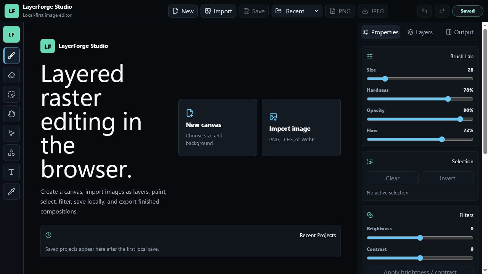 | LayerForge Studio is the strongest frontend implementation: a local-first browser image editor with layered raster documents, Canvas 2D painting, selections, filters, undo, IndexedDB persistence, and PNG/JPEG export. It shows deeper UI architecture, interaction design, and application polish. |

## Shipped Commercial Products

This section is separate from the open portfolio apps because the product source and buyer package are maintained outside this repository.

| Product | Public Link | Commercial Surface | What It Shows |
| --- | --- | --- | --- |
| QuoteForge Local | [Live Demo](https://quoteforge-local.vercel.app/) | [Payhip Product Page](https://payhip.com/b/24De9) | A packaged local-first quoting product with buyer-facing setup, customization, embed, WordPress, QA, licensing, and sales materials. |

## Supplemental Public Demos

These public demos are visible in the Portfolio Hub but are not treated as primary source-backed repo applications unless their source is present under `apps/`.

| Demo | Public Link | Repo Status | How to Interpret It |
| --- | --- | --- | --- |
| [Amino Acid Research Workbench](projects/amino-acid-research-workbench/CASE_STUDY.md) | [Live Demo](https://aminoacidworkbench.netlify.app/) | Documentation-first case study in this repo; no local `apps/` workspace | Useful educational bioinformatics evidence, but VariantVision Pro is the source-backed runnable research app. |
| GardenGrid | [Live Demo](https://garden-grid-planner-demo.netlify.app/) | Source not present in this repo | Supplemental external planning demo only. |
| HearthLink | [Live Demo](https://hearthlink-p2p-demo.netlify.app/) | Source not present in this repo | Supplemental external static concept demo with documented limitations. |

## Employer-Facing Project Guides

This repository also includes employer-facing documentation for the strongest projects in the portfolio:

- [Employer Overview](docs/EMPLOYER_OVERVIEW.md)
- [Project Index](docs/PROJECT_INDEX.md)
- [Skills Matrix](docs/SKILLS_MATRIX.md)
- [Hiring Summary](docs/hiring-summary.md)
- [Project Ranking](docs/project-ranking.md)
- [Portfolio Positioning](docs/portfolio-positioning.md)

## Additional Materials

Supporting materials that are useful for deeper review, but should not clutter the repository root:

- [Dairy autoimmunity research materials](docs/research/dairy-autoimmunity/)
- [Job-search materials](docs/job-search/)
- [FocusForge prompt materials](prompts/focusforge/)
- [GitHub profile README setup](docs/github-profile/)
- [GitHub repository settings checklist](docs/github-repo-settings.md)
- [Deployment and preview map](docs/deployment-and-previews.md)
- [Root loose-file archive](_archive/root-loose-files/)

## Strongest Case Studies

| Project | Status | Why Review It |
| --- | --- | --- |
| [BuildWorld AI](projects/buildworld-ai/CASE_STUDY.md) | Runnable MVP + live demo | Most technically ambitious app: graph simulation studio, deterministic engines, SSI scoring, cascade analyzer, optimization lab, snapshots, reports, tests, and live deployment. |
| [RedactReady Pro](projects/redactready-pro-hri-os/CASE_STUDY.md) | Runnable MVP + live demo | Flagship local-first privacy intelligence product with deterministic detection, HRI scoring, evidence mapping, redaction, reports, tests, and polished deployment. |
| [ScamShield AI](projects/scamshield-ai/CASE_STUDY.md) | Runnable MVP + live demo | Complete public-interest safety workflow with explainable risk signals, caregiver/plain-language modes, evidence organization, official reporting guidance, and PDF export. |
| [RedactReady](projects/redactready-local/CASE_STUDY.md) | Runnable MVP | Strongest privacy/security product; shows local-first architecture, document processing, true redaction, and safety-focused UX. |
| [LayerForge Studio](projects/layerforge-studio/CASE_STUDY.md) | Runnable MVP | Strongest frontend/canvas implementation and best evidence of dense product UI polish. |
| [OpsPilot](projects/opspilot-ai-operations-toolkit/CASE_STUDY.md) | Runnable MVP + live demo | Strongest business-focused micro-SaaS; directly maps to operations, documentation, onboarding, and knowledge-management roles. |
| [FocusForge](projects/focusforge/CASE_STUDY.md) | Runnable MVP + live demo | Polished local-first productivity game with durable state, timer recovery, progression systems, and static deployment. |
| [AI Knowledge Operations Toolkit](projects/ai-knowledge-operations-toolkit/CASE_STUDY.md) | Concept / product specification | Best direct match for operations, documentation, support, and knowledge-management roles. |
| [VariantVision Pro](projects/variantvision-pro/CASE_STUDY.md) | Runnable MVP + live demo | Bioinformatics evidence workbench with source transparency, local normalization helpers, amino-acid comparison, evidence scoring, and report export. |
| [Amino Acid Research Workbench](projects/amino-acid-research-workbench/CASE_STUDY.md) | Educational tool concept | Strong educational bioinformatics tool with explainable analysis workflows. |
| [Ecology of Consciousness](projects/ecology-of-consciousness/CASE_STUDY.md) | Research framework | Strongest original research/framework project. |

## Project Status

| Project | Current Form | Repository Evidence | Demo Type | Case Study? |
| --- | --- | --- | --- | --- |
| Portfolio Hub | Runnable MVP | Yes | GitHub Pages / local | Recruiter guide |
| BuildWorld AI | Runnable MVP | Yes | Live / local / Netlify | Yes |
| RedactReady Pro | Runnable MVP | Yes | Live / local / Netlify | Yes |
| ScamShield AI | Runnable MVP | Yes | Live / local / Netlify | Yes |
| RedactReady | Runnable MVP | Yes | Live / local / Netlify | Yes |
| OpsPilot | Runnable MVP | Yes | Live / local / Netlify | Yes |
| FocusForge | Runnable MVP | Yes | Live / local / Netlify | Yes |
| LayerForge Studio | Runnable MVP | Yes | GitHub Pages subpath / local | Yes |
| Astra | Runnable MVP | Yes | Local | Yes |
| Nexus Play | Runnable MVP | Yes | Local | Yes |
| AI Knowledge Operations Toolkit | Product concept / workflow system | Documentation-first | Planned / spec | Yes |
| VariantVision Pro | Runnable MVP | Yes | Live / local / Netlify | Yes |
| Amino Acid Research Workbench | Educational bioinformatics concept | Documentation-first case study; no local `apps/` workspace | Supplemental Netlify demo / spec | Yes |
| Ecology of Consciousness | Research framework | Documentation-first | Framework docs | Yes |
| [IHOS](projects/ihos-integrated-human-operating-system/CASE_STUDY.md) | Structured self-governance framework | Documentation-first | Framework docs | Yes |
| [FrameEcho](projects/frameecho/CASE_STUDY.md) | Technical product concept | Documentation-first | Planned / spec | Yes |
| GardenGrid | Supplemental external planning demo | No - source not present in this repo | Live Netlify supplemental | No |
| HearthLink | Supplemental external community concept demo | No - source not present in this repo | Live Netlify supplemental | No |

## Screenshots

| BuildWorld AI studio | BuildWorld AI report |
| --- | --- |
|  | 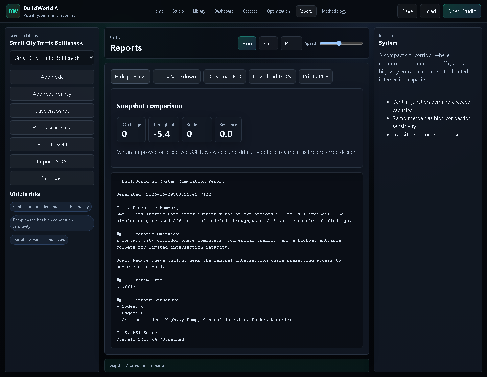 |

| ScamShield AI landing | ScamShield AI assessment |
| --- | --- |
| 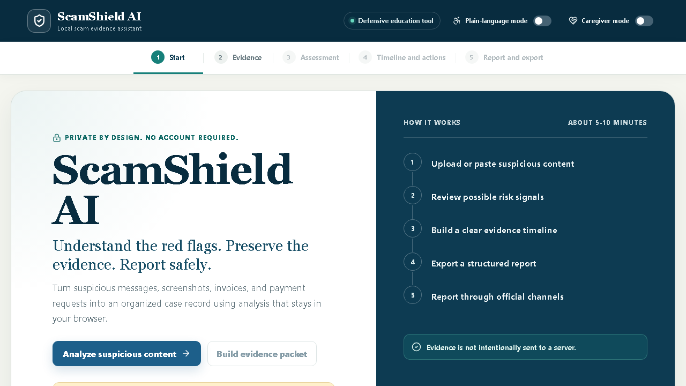 |  |

| RedactReady Pro | RedactReady | OpsPilot |
| --- | --- | --- |
|  |  |  |

| Astra |
| --- |
|  |

| Nexus Play | LayerForge Studio |
| --- | --- |
|  |  |

| FocusForge forge | FocusForge focus session |
| --- | --- |
|  | 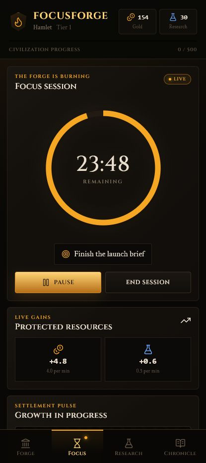 |

## LayerForge Studio Demo

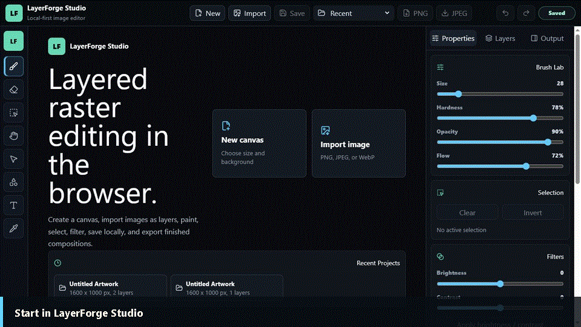

## Repository Layout

```text
apps/
  portfolio-hub/          Public employer-facing portfolio review hub
  buildworld-ai/          Visual systems simulation lab with graph canvas, SSI scoring, and reports
  scamshield-ai/         Runnable local-first scam safety and evidence workspace
  redactready-local/       Runnable local-first privacy redaction engine
  opspilot-ai-operations-toolkit/  Runnable AI operations documentation toolkit
  focusforge/            Runnable local-first gamified productivity app
  redactready-pro-hri-os/  Flagship local-first document intelligence and HRI scoring OS
  astra/                 Runnable local AI chat application
  nexus-play/            Runnable game storefront and platform demo
  layerforge-studio/     Runnable local-first layered raster image editor

projects/
  buildworld-ai/                             Systems simulation and data-visualization case study
  scamshield-ai/                            Consumer-protection cybersecurity case study
  redactready-pro-hri-os/                   Flagship privacy intelligence case study
  redactready-local/                         Privacy/security redaction case study
  opspilot-ai-operations-toolkit/             Employer-facing case study
  focusforge/                                Gamified productivity app case study
  layerforge-studio/                         Employer-facing case study
  ai-knowledge-operations-toolkit/           Operations AI workflow case study
  variantvision-pro/                         Bioinformatics research-tool case study
  amino-acid-research-workbench/             Educational bioinformatics case study
  ecology-of-consciousness/                  Research framework case study
  ihos-integrated-human-operating-system/    Structured self-governance case study
  astra/                                     AI chat workspace case study
  nexus-play/                                Game platform case study
  frameecho/                                 Duplicate video finder concept

docs/
  EMPLOYER_OVERVIEW.md
  PROJECT_INDEX.md
  SKILLS_MATRIX.md
  deployment-and-previews.md
  PORTS.md
  github-profile/
  job-search/
  hiring-summary.md
  project-ranking.md
  portfolio-positioning.md
  research/

prompts/
  focusforge/

_archive/
  README.md
  root-loose-files/
```

Each runnable application is self-contained with its own `package.json`, README, source code, and lockfile. Root-level documentation has been consolidated into `docs/` to keep the public repository clean and easy to review.

## Quick Start

Install and run a specific app:

```bash
cd apps/astra
npm install
npm run dev
```

Use the same pattern for `apps/portfolio-hub`, `apps/buildworld-ai`, `apps/redactready-pro-hri-os`, `apps/scamshield-ai`, `apps/redactready-local`, `apps/nexus-play`, `apps/layerforge-studio`, `apps/opspilot-ai-operations-toolkit`, and `apps/focusforge`.

## Root Convenience Scripts

From the repository root:

```bash
npm run install:all
npm run build:all
npm run lint:apps
npm run typecheck:all
npm run test:all
npm run verify
npm run dev:portfolio
npm run dev:astra
npm run dev:nexus
npm run dev:layerforge
npm run dev:opspilot
npm run dev:focusforge
npm run dev:variantvision
npm run dev:redactready-pro
npm run dev:buildworld
npm run dev:redactready
npm run dev:scamshield
```

## Validation

Use [docs/verification.md](docs/verification.md) for the current validation table, supported app scripts, and manual verification notes. The main portfolio-level commands are:

```bash
npm install
npm run lint:apps
npm run typecheck:all
npm run test:all
npm run build:all
npm run verify
```

GitHub Pages publishes the portfolio hub at the repository Pages root and preserves LayerForge Studio under `/layerforge-studio/`:

```bash
GITHUB_PAGES=true npm run build --workspace apps/portfolio-hub
GITHUB_PAGES=true npm run build --workspace apps/layerforge-studio
```

## Portfolio Focus

These projects demonstrate:

- End-to-end product development from idea to runnable local app.
- React, TypeScript, Vite, Express, and modern frontend architecture.
- Local API design, validation, streaming responses, and stateful demo workflows.
- Business-focused AI operations tooling for SOPs, onboarding, documentation, and knowledge management.
- Portfolio-quality UX polish, responsive layouts, and documentation.
- Privacy-first document processing, threat modeling, and verification-minded UX.
- AI-assisted research and prompt workflow documentation.
- Technical operations thinking, knowledge management, and structured workflow design.

## Notes

- Astra requires a Gemini API key in `apps/astra/.env.local` for live model responses. The UI still runs and clearly reports configuration status without a key.
- BuildWorld AI is live on Netlify, runs deterministic educational graph simulations locally in the browser, and does not require an account, backend, API key, or database. Its SSI score is an exploratory portfolio/demo metric, not a certified engineering or public-health model.
- RedactReady Pro is live on Netlify, runs deterministic analysis locally in the browser, and does not require an account, backend, API key, or database.
- RedactReady is local-first and does not require an API key or backend upload service for core redaction.
- ScamShield AI is live on Netlify, runs its analysis locally, and does not require an account, backend, API key, or database.
- OpsPilot is live on Netlify, runs its drafting workflow locally in the browser, and does not require an account, backend, API key, or database.
- FocusForge is live on Netlify, stores progress in the browser, and does not require an account, backend, API key, or database.
- VariantVision Pro is live on Netlify, uses curated demo fixtures for educational research triage, and does not provide diagnosis, treatment guidance, genetic counseling, risk prediction, or ACMG/AMP classification.
- Portfolio Hub is live on GitHub Pages, uses static screenshot assets, and does not require an account, backend, API key, or database.
- Nexus Play uses a local in-memory demo account and simulated checkout. It does not process real payments.
- LayerForge stores projects locally in browser IndexedDB.
- Documentation-first projects are intentionally labeled as concepts, frameworks, or specifications when they are not implemented as runnable apps in this repository.
