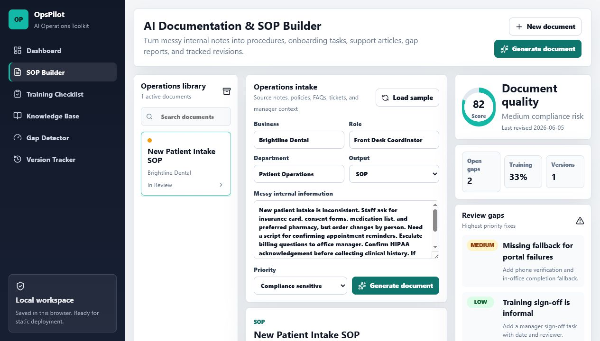

# OpsPilot: AI Operations Toolkit for Small Businesses

OpsPilot is a portfolio-grade micro-SaaS prototype that helps small businesses turn messy internal knowledge into usable operations documents. It converts notes, policies, tickets, and FAQs into SOPs, onboarding checklists, knowledge base articles, gap reports, and tracked document versions.

The app is intentionally tool-first: the first screen is the working operations dashboard, not a marketing page.



## Why This Project Exists

Small businesses often run on scattered emails, half-finished docs, manager memory, and inconsistent training. OpsPilot demonstrates how an AI operations product could reduce that admin chaos by creating structured, reviewable documentation from rough internal information.

## Core Features

- **SOP Generator**: turns rough notes into step-by-step procedures with owners, timing, and quality checks.
- **Training Checklist Builder**: creates onboarding tasks by role and tracks completion.
- **Knowledge Base Generator**: converts FAQs, tickets, and policies into short help articles.
- **Documentation Gap Detector**: flags missing owners, weak escalation paths, unclear completion tracking, and review gaps.
- **Version Tracker**: records generated, edited, saved, and published document snapshots.
- **Export Workflow**: supports browser PDF export and downloadable Markdown.
- **Local Persistence**: keeps documents in browser `localStorage` so the product works without a backend.
- **Deploy Ready**: includes Netlify build config, SPA fallback, security headers, and cache headers.

## Product Highlights

- Three-column operations workspace with document library, intake/generator, and review insights.
- Deterministic local drafting engine that simulates the product workflow without requiring API keys.
- Responsive mobile layout for review and demo use.
- Strict TypeScript model for documents, findings, training items, articles, and versions.
- Portfolio documentation and screenshots included for hiring-manager review.

## Tech Stack

- React 19
- TypeScript
- Vite
- Lucide React icons
- Plain CSS design system
- Netlify static deployment config

## Run Locally

```bash
cd "C:\Users\Atomic\Documents\New project\opspilot-ai-operations-toolkit"
npm install
npm run dev
```

Open:

```text
http://127.0.0.1:5177/
```

## Build and Preview

```bash
npm run lint
npm run build
npm run preview
```

Preview opens at:

```text
http://127.0.0.1:4177/
```

## Deploy

This is a static Vite app. Netlify can deploy it directly from the repository:

- Build command: `npm run build`
- Publish directory: `dist`
- Node version: `22`

The included `netlify.toml` already defines those settings.

## Project Structure

```text
src/
  App.tsx        Main product shell and workflow UI
  data.ts        Seed notes and example documents
  opsEngine.ts   Local drafting, gap detection, scoring, versioning, export helpers
  styles.css     Product design system and responsive layout
  types.ts       Shared operations document types
docs/
  screenshots/   Portfolio screenshots
  PORTFOLIO_CASE_STUDY.md
```

## Validation

Current verification:

- `npm run lint`
- `npm run build`
- Browser smoke test: load sample, generate document, toggle training item, fix gap, publish, export Markdown.
- Desktop and mobile screenshots inspected.
- Browser console errors: `0`

## Future SaaS Path

The current drafting engine is local and deterministic for deployment simplicity. A production SaaS version would add:

- OpenAI-backed drafting and revision endpoint.
- Organization, team, and document permissions.
- Database-backed document history.
- PDF export service.
- Integrations for Google Drive, Slack, Notion, and help desk tools.
- Billing, plan limits, and audit logs.

See [Portfolio Case Study](docs/PORTFOLIO_CASE_STUDY.md) for product and engineering notes.
