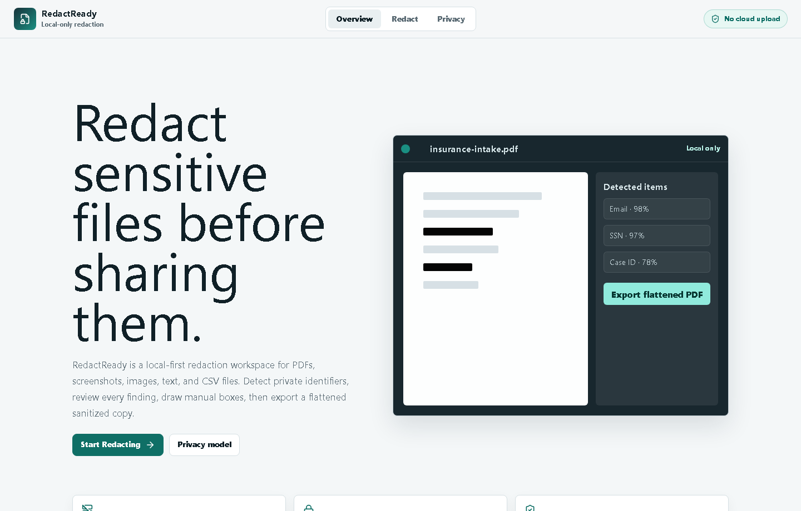

# RedactReady

RedactReady is a production-quality local-first MVP for privacy-preserving document redaction. It accepts PDF, PNG/JPG, TXT, and CSV files, detects common sensitive patterns, requires human review, supports manual redaction boxes, exports flattened redacted files, and generates a redaction report that does not expose raw sensitive values.

This project was created as a separate app in `redactready-local` so existing projects in the parent workspace are not overwritten.

## Portfolio Highlights

- Local-first privacy architecture with no document upload backend.
- True redaction strategy for PDFs and images through flattened canvas/pixel export.
- Review-first workflow with category filters, masked previews, confidence indicators, custom search, and manual redaction boxes.
- Testable TypeScript modules for detectors, text replacement, verification, and reports.
- Production-adjacent project hygiene: CI workflow, Netlify config, security notes, sample fixtures, and a portfolio case study.

See [docs/portfolio-case-study.md](docs/portfolio-case-study.md) for a deeper engineering/product breakdown.

## Screenshots




## Quick Start

```bash
npm install
npm run dev
```

Open:

```text
http://127.0.0.1:5173/
```

## Scripts

```bash
npm run dev      # local Vite dev server
npm run build    # TypeScript and production build
npm run lint     # ESLint
npm run test     # Vitest unit tests
npm run e2e      # Playwright smoke test
npm run preview  # production preview server
```

## Deploy on Netlify

This is a static Vite application and includes `netlify.toml`.

Recommended Netlify settings:

```text
Build command: npm run build
Publish directory: dist
Node version: 20
```

## MVP Scope

- PDF import with local PDF.js rendering.
- PDF text-layer scanning where selectable text exists.
- Flattened PDF export using canvas rendering plus `pdf-lib`.
- PNG/JPG import, manual pixel redaction, and redacted PNG export.
- TXT/CSV import, regex detection, replacement export, and verification.
- Detection review queue with category filters, confidence, approve/reject controls, and custom search.
- Manual redaction boxes with move, resize, delete, page navigation, and zoom.
- JSON redaction log with category counts, verification status, and limitations.
- No document upload backend, telemetry, or analytics.

## Detection Categories

Implemented deterministic detectors cover:

- Email addresses
- Phone numbers
- SSN-like identifiers
- Dates and date-of-birth-like values
- Payment-card-like numbers with Luhn validation
- Account, policy, member, and routing-number-like values
- Case, claim, order, invoice, and reference IDs
- Employee, client, student, and patient IDs
- Medical identifiers such as MRN/member/RX patterns
- Secret/API-token-like values and private URLs
- Address-like values
- Name-like values when introduced by labels such as `Name:` or `Patient:`
- Custom user-entered search terms
- QR/barcode detection when the browser exposes the native `BarcodeDetector` API

## Architecture

```text
src/
  components/          Upload, workspace toolbar, canvas editor, sidebar, export panel
  pages/               Landing, redaction workspace, privacy/limitations page
  state/               Zustand redaction session store
  lib/detectors/       Regex, heuristic, custom, and browser visual detectors
  lib/files/           File type detection and local loaders
  lib/pdf/             PDF.js render and text-layer extraction
  lib/redaction/       Canvas redaction, flattened PDF export, text replacement, reports, verification
  tests/               Vitest coverage for detectors, text export, reports, verification
e2e/                   Playwright text-upload smoke test
samples/               Synthetic TXT/CSV fixtures
```

## Privacy Model

Core processing happens in the browser. The MVP does not define any API route that receives user documents, does not persist uploaded files to a remote service, and does not include analytics. Documents are held in session memory until the page is refreshed or the user clears the session.

PDFs and images are exported by painting approved redaction rectangles directly into canvas pixels. PDFs are re-created as image-backed PDFs so the original text layer is not intentionally preserved. TXT and CSV files are exported by replacing approved ranges with category labels such as `[REDACTED_EMAIL]`.

## Threat Model

RedactReady helps reduce accidental disclosure from visible identifiers, searchable PDF text, source metadata carried by original PDFs, and common structured secrets. It does not protect against compromised browsers, malicious input files, operating-system capture, browser extensions with file access, or users exporting before reviewing missed content.

## Verification

- TXT/CSV exports are checked to ensure approved raw values no longer appear in exported text.
- PDF exports report that pages were rasterized and flattened into a new PDF.
- PDF verification warns when a text-layer detection cannot be mapped to a reliable visual box.
- Image exports confirm that approved boxes were painted into output pixels.
- Reports intentionally omit raw sensitive values.

## Known Limitations

- OCR is not enabled in this MVP, so scanned PDFs and screenshots may require manual boxes.
- Face, signature, handwriting, and license-plate detection are roadmap items.
- Name and address detection use conservative heuristics and require manual review.
- PDF text-to-box mapping is approximate because PDF text layers often do not preserve natural reading geometry.
- Exported PDFs are flattened and not selectable or accessibility-tagged.
- DOCX/XLSX layout-preserving redaction is planned, not included in V1.
- The app does not claim HIPAA, GDPR, FERPA, SOC 2, legal, medical, or compliance certification.

## Test Plan

1. Run `npm run test` for detector, replacement export, verification, and report coverage.
2. Run `npm run build` to verify TypeScript and production bundling.
3. Run `npm run e2e` after Playwright browsers are installed to smoke-test the text upload workflow.
4. Manual browser QA:
   - Upload `samples/sample-sensitive.txt`.
   - Confirm email, phone, SSN, DOB, case, policy, and secret detections.
   - Reject one detection and confirm it remains in preview.
   - Add a custom term and confirm it appears in the review queue.
   - Export redacted text and JSON report.
   - Upload a PDF/image, draw a manual box, move/resize it, and export flattened output.

## Roadmap

- Add local OCR with a worker-based Tesseract.js pipeline.
- Improve PDF text geometry using text-content item clustering.
- Add local face and signature detection.
- Add Office-file extraction and safe redacted PDF export for DOCX/XLSX.
- Add encrypted local session save/load.
- Add batch processing and reusable redaction policies.
- Package as a Tauri desktop app.
