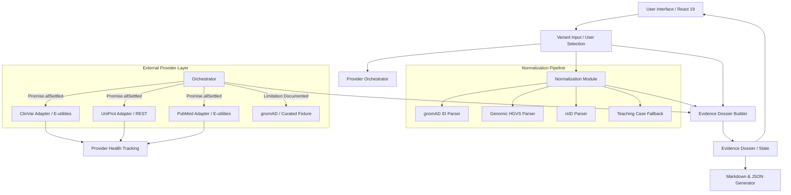

# VariantVision Pro — System Architecture

VariantVision Pro is an evidence-first bioinformatics workbench engineered to aggregate, normalize, interpret, and present genomic variant evidence from multiple authoritative scientific sources.

This document describes the software architecture, data flow, provider abstraction, normalization pipeline, and error handling model.

---

## 1. Architectural Principles

1. **Provenance First**: Every claim, classification, frequency, or literature lead retains its original source, URI, review status, and retrieval timestamp.
2. **Graceful Partial Failure**: External scientific APIs fail independently (timeouts, CORS restrictions, maintenance, missing endpoints). If one provider fails, the workbench continues operating with remaining providers.
3. **Explicit Boundaries**: The application enforces clear visual and textual boundaries separating educational research triage from clinical diagnosis or ACMG/AMP classification.
4. **Deterministic Domain Core**: Amino acid comparison, normalization parsing, and evidence scoring are 100% pure functions with zero external dependencies.

---

## 2. Component Diagram & Data Flow



---

## 3. Provider Abstraction Layer

All external data sources implement the `ProviderResult<T>` interface:

```typescript
export interface ProviderResult<T> {
  provider: ProviderName
  status: 'success' | 'no_result' | 'error' | 'timeout' | 'unavailable' | 'unsupported_variant'
  data: T | null
  error: string | null
  retrievedAt: string // ISO 8601
  variantIdUsed: string
  sourceUrl: string | null
  warnings: string[]
  durationMs: number
}
```

### Key Components

- **ClinVar Adapter (`src/providers/clinvar.ts`)**: Queries NCBI E-utilities (`esearch` + `esummary`) by rsID to retrieve variation records, assertions, and star ratings.
- **UniProt Adapter (`src/providers/uniprot.ts`)**: Queries UniProt REST API (`rest.uniprot.org`) by accession ID to retrieve functional annotations, subcellular location, and review status (Swiss-Prot vs TrEMBL).
- **PubMed Adapter (`src/providers/pubmed.ts`)**: Queries NCBI E-utilities by gene and variant terms to retrieve recent literature leads with PMIDs.
- **Orchestrator (`src/providers/orchestrator.ts`)**: Executes all active providers concurrently via `Promise.allSettled` with configurable timeouts (default 8000ms). Returns unified `OrchestratorResult` containing data and provider health metrics.

---

## 4. Variant Normalization Pipeline

Variant inputs are routed through four sequential normalization strategies in `src/modules/variant/normalizeVariant.ts`:

1. **gnomAD-style ID**: Matches `^([0-9XYM]+)-(\d+)-([ACGTN]+)-([ACGTN]+)$`. Resolves directly to gnomAD dataset URL and 1-based coordinate string.
2. **Genomic HGVS**: Matches `g.(\d+)([ACGT])>([ACGT])` with RefSeq chromosome inference (`NC_000011` → Chr 11).
3. **rsID Lookup**: Matches `^rs\d+$`. Routes to NCBI dbSNP URL for coordinate resolution.
4. **Teaching Case Fallback**: Matches canonical educational examples (e.g. HBB E6V / HbS) to GRCh37 or GRCh38 coordinates.

If all local normalization paths fail, the system assigns status `manual review required` rather than generating unsafe coordinate assumptions.

---

## 5. Evidence Coverage & Scoring Model

The `buildDossier` engine computes an Evidence Coverage Score (0–100) across 5 weighted components:

1. **Normalization (20%)**: Evaluates whether the variant maps to a coordinate-level identifier.
2. **Population Frequency (20%)**: Evaluates availability of population allele frequency data.
3. **Curated Database Review (20%)**: Evaluates ClinVar classifications and review status stars.
4. **Protein / Structure Context (20%)**: Evaluates UniProt functional annotation and domain mapping.
5. **Literature Handoff (20%)**: Evaluates availability of primary PubMed citations.

Confidence bands:
- **82–100**: Strong research dossier
- **60–81**: Usable with review
- **0–59**: Incomplete dossier

---

## 6. Security and Privacy Policy

- **No API Keys Required**: Public endpoints (NCBI E-utilities, UniProt REST) are used without private keys, avoiding client-side credential exposure.
- **No PHI Storage**: Local state exists only in memory; no patient data is logged or transmitted.
- **Strict Content Sanitization**: All external text fields are treated as plain text strings rendered safely via React.
