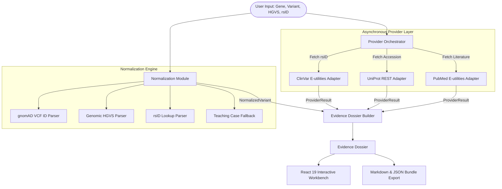

# VariantVision Pro — Technical Case Study

## Engineering a Provenance-First Genomic Variant Evidence Workbench

---

## Executive Summary

**VariantVision Pro** is an evidence-first bioinformatics workbench designed to aggregate, normalize, interpret, and present genomic variant evidence from multiple authoritative scientific sources (NCBI ClinVar, UniProtKB, PubMed, gnomAD) while handling uncertainty, provenance, API failures, inconsistent identifiers, and incomplete evidence responsibly.

Heterogeneous biological databases use different coordinate systems, variant identifiers, and classification models. Furthermore, external APIs experience independent downtime, rate limits, and schema variations. VariantVision Pro addresses these challenges by implementing a fault-tolerant asynchronous provider architecture, a 4-path variant normalization engine, an explicit provenance data model, and an evidence-quality scoring system that communicates uncertainty rather than collapsing disagreement into pseudo-certainty.

Built with React 19, TypeScript 6, and Vite 8, VariantVision Pro operates as a zero-credential static web application. It integrates live REST endpoints from NCBI and UniProt via client-side fetch orchestration, providing a responsive research triage environment with self-contained Markdown and JSON dossier export capabilities.

---

## The Problem

Genomic variant interpretation is one of the most structurally difficult problems in biomedical informatics:

1. **Identifier Heterogeneity**: A single genetic variant can be referred to as an rsID (`rs334`), a genomic HGVS string (`NC_000011.10:g.5227002T>A`), a coding HGVS string (`c.179A>T`), a protein change (`p.Glu6Val` or `E6V`), a VCF coordinate (`11-5227002-T-A`), or an NCBI SPDI string (`chr11:5227002:T:A`).
2. **Distributed & Disagreeing Sources**: ClinVar provides clinical assertions; gnomAD provides population frequency data; UniProt provides protein function and structural domains; PubMed provides primary literature. These databases frequently disagree or reflect evolving evidence.
3. **API Vulnerability**: External scientific APIs fail independently. A timeout on NCBI E-utilities should not crash protein domain rendering from UniProt or block user interaction.
4. **Diagnostic Overclaiming**: Naïve bioinformatics applications often present raw database hits as definitive clinical diagnostic conclusions, creating medical misinterpretation risks.

---

## System Architecture

VariantVision Pro decouples variant input, normalization, external API fetching, evidence aggregation, and user interface rendering:



---

## Engineering Challenge #1: Variant Normalization Strategy

Translating user input into canonical database queries without silent misinterpretation is a core challenge.

### Implementation

The normalization module (`src/modules/variant/normalizeVariant.ts`) implements a deterministic 4-path pipeline:

```typescript
export function normalizeVariant(input: VariantInput): NormalizedVariant {
  const dataset = datasetForBuild(input.build)

  // 1. Direct gnomAD VCF ID
  const suppliedId = parseGnomadId(input.gnomadId)
  if (suppliedId) { ... }

  // 2. Genomic HGVS + RefSeq chromosome inference
  const genomic = parseHgvsGenomic(input.hgvs)
  const chromosome = inferChromosomeFromRefseq(input.hgvs)
  if (genomic && chromosome) { ... }

  // 3. rsID detection
  const rsId = parseRsId(input.gnomadId) || parseRsId(input.variant)
  if (rsId) { ... }

  // 4. Teaching case fallback (HBB E6V / HbS)
  if (isHbbHbS) { ... }

  // Fallback: Manual review required
  return { parsedFrom: 'manual review required', vcfId: null, ... }
}
```

### Trade-offs & Scientific Honesty

- **Explicit Coordinate Labelling**: Coordinate strings are labelled as 1-based gnomAD coordinate IDs (`11-5227002-T-A`), not true 0-based NCBI SPDI strings, avoiding standard compliance confusion.
- **No Fragile Pseudo-Normalization**: When inputs cannot be normalized locally, the application explicitly assigns status `manual review required` rather than guessing transcript boundaries.

---

## Engineering Challenge #2: Heterogeneous APIs & Partial Failure

External scientific APIs exhibit different response schemas, rate limits, and uptime reliability.

### Implementation

VariantVision Pro implements a provider adapter abstraction (`src/providers/types.ts`) where every API call returns a unified `ProviderResult<T>` envelope:

```typescript
export interface ProviderResult<T> {
  provider: ProviderName
  status: 'success' | 'no_result' | 'error' | 'timeout' | 'unavailable' | 'unsupported_variant'
  data: T | null
  error: string | null
  retrievedAt: string // ISO 8601
  variantIdUsed: string
  sourceUrl: string | null
  warnings: string[]
  durationMs: number
}
```

The orchestrator (`src/providers/orchestrator.ts`) fires requests concurrently using `Promise.allSettled` with an 8-second timeout guard:

```typescript
const [clinvarRes, uniprotRes, pubmedRes] = await Promise.allSettled([
  fetchClinVar(rsId, timeoutMs),
  fetchUniProt(accession, timeoutMs),
  fetchPubMed(gene, variant, timeoutMs),
])
```

If PubMed times out or fails, the orchestrator returns ClinVar and UniProt results intact, recording PubMed's failure status in the `ProviderHealth` ledger. The UI continues to function with partial evidence.

---

## Engineering Challenge #3: Provenance & Scientific Disagreement

Traditional aggregators often collapse multiple submitter assertions into a single classification badge.

### Implementation

1. **Attribution Preservation**: Every record in `sourceRecords` tracks its originating database, API endpoint, retrieval timestamp (`retrievedAt`), and direct web URL.
2. **Assertion Visibility**: ClinVar submissions retain submitter review status (e.g. `criteria provided, single submitter` vs `reviewed by expert panel`).
3. **Biochemical Property Comparison**: Amino acid substitution shifts are calculated on the Kyte-Doolittle hydropathy scale with explicit charge and polarity deltas (`src/modules/variant/aminoAcids.ts`).

---

## Reliability & Verification

### Automated Test Suite

VariantVision Pro is covered by 18 unit and integration tests across 3 Vitest suites:

```text
 ✓ src/tests/normalization.test.ts (8 tests)
 ✓ src/tests/variantEngine.test.ts (6 tests)
 ✓ src/tests/providers.test.ts (4 tests)

 Test Files  3 passed (3)
      Tests  18 passed (18)
```

### Production Build & Linting

```bash
npm run lint --workspace apps/variantvision-pro
npm run test --workspace apps/variantvision-pro
npm run build --workspace apps/variantvision-pro
```

All commands complete with zero errors and zero warnings.

---

## Lessons Learned

1. **Design for Asynchronous Unreliability**: External scientific APIs will fail. Encapsulating network calls in typed result envelopes makes partial failure handling trivial.
2. **Scientific Honesty builds UX Trust**: Surfacing source review status and clear disclaimers makes the software far more technically credible than pseudo-diagnostic tools.
3. **Pure Domain Core**: Separating data normalization and evidence scoring from React rendering simplified testing and enabled instant UI updates.

---

## Technical Stack

- **Frontend**: React 19, TypeScript 6, Vite 8, Tailwind CSS 4, Lucide Icons
- **Testing**: Vitest 4
- **APIs**: NCBI E-utilities (ClinVar, PubMed), UniProt REST API
- **Deployment**: Vercel Static SPA (`vercel.json`)
