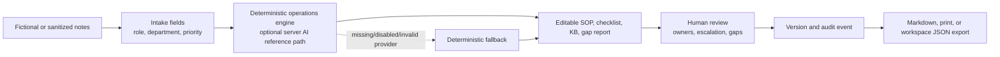

# ProcessHarbor Pro: Turning rough operating knowledge into reviewable documents

## Executive summary

ProcessHarbor Pro is a local-first operations-document workflow for transforming rough notes, tickets, FAQs, and policy fragments into editable SOPs, onboarding checklists, knowledge-base drafts, documentation-gap findings, versions, audit events, and export bundles. It began as OpsPilot and was explicitly renamed in commit `2519882`; see [the canonical model](../portfolio-remediation/PROCESSHARBOR-CANONICAL-MODEL.md).

**Technical implementation verified; external workflow outcome not yet validated.** The default browser route is a deterministic `localStorage` demo. It is prepared for pilot evaluation, not represented as production workflow automation, durable multi-user storage, deployed server AI, or measured time savings.

## Problem and intended user

Small teams often hold recurring operating knowledge in fragmented notes and manager memory. The intended users are small-business owners, operations managers, documentation/enablement leads, and service/support teams that need an editable starting point for repeatable work—not an automatic replacement for subject-matter review.

The operational context is a reviewer taking fictional or sanitized notes about an intake, service, support, or policy workflow and converting them into a document set that names owners, handoffs, exceptions, quality checks, and review cadence.

## 60-second reviewer summary

1. Load fictional/sanitized operational notes or enter a small intake.
2. Generate a deterministic draft with SOP steps, training tasks, knowledge-base articles, and gap findings.
3. Review the draft, ownership, risks, and open gaps before changing status or publishing.
4. Record versions and audit events; mark a finding fixed only after human review.
5. Export Markdown, print through the browser, or download the workspace JSON bundle.

The optional server-side AI reference path is deliberately disabled by default and falls back to the deterministic engine. No independent time-savings, productivity, adoption, or commercial result has been established.

## Workflow, decisions, and controls

| Stage | Inputs and decision point | Human-review control | Output |
| --- | --- | --- | --- |
| Intake | Business, role, department, priority, and free-form notes | Reviewer confirms the source is fictional/sanitized and edits the fields | Structured intake |
| Draft | Local deterministic engine identifies steps, owners, gaps, and score | Reviewer checks accountability, escalation, completion record, and scope | SOP/checklist/KB/gap draft |
| Review | Open gaps and document status are visible | A person marks gaps fixed, updates content, creates versions, and decides whether to publish | Reviewable document state |
| Handoff | Audit history and export action | Reviewer chooses what to export and verifies output before use | Markdown, print dialog, workspace JSON |

## Architecture and data flow

- React 19 + TypeScript + Vite provide the browser application.
- `src/opsEngine.ts` deterministically normalizes input, produces document steps/checklists/articles, identifies gaps, scores a document, creates versions, and produces Markdown.
- `src/schemas.ts` and `server/` provide Zod-validated reference contracts, role checks, audit/export shapes, optional provider integration, and error normalization.
- Browser demo state is stored in `localStorage`; the reference repository uses seeded in-memory persistence. `database/migrations/001_init.sql` is a Postgres-compatible future persistence design, not evidence of a connected database.
- The static Vercel surface is `https://ai-project-portfolio-opspilot-ai-op.vercel.app/`; its legacy hostname corresponds to the preserved OpsPilot implementation alias. The source is `atomicdjt/AI-Project-Portfolio`, `apps/opspilot-ai-operations-toolkit` on the authoritative `main` branch after approval of local work.

## Important design choices and tradeoffs

| Decision | Why | Tradeoff |
| --- | --- | --- |
| Deterministic demo by default | A reviewer can inspect real workflow behavior without credentials, provider cost, or secret exposure | Drafting is rules-based and not a claim of model quality |
| Explicit review, gap, version, and audit surfaces | Makes uncertainty and handoff visible instead of silently presenting a finished answer | More steps than a one-click document generator |
| Optional server-side AI only | Keeps credentials and provider calls outside the client and preserves fallback behavior | The current static route does not expose that reference capability |
| Local browser persistence | Supports a runnable demo without a database | It is not durable shared storage or tenant isolation |
| Legacy aliases preserved | Keeps history, deployment traceability, and links intact | The public URL and directory remain less polished than the product name |

## David Turner and AI-assistance roles

David Turner designed and implemented the operations workflow, browser interface, deterministic transformation logic, validation/authorization reference layer, migration shape, documentation, proof assets, and release boundaries reflected in this repository.

AI assistance is optional and explicitly bounded: the source documents a server-side OpenAI Responses adapter with structured-output validation, rate limiting, error normalization, and deterministic fallback. The verified default workflow does not require an API key or make a provider call. AI output is a draft for human review, not professional, legal, medical, HR, compliance, or safety advice.

## Testing and exact evidence

The following commands were executed in the isolated remediation clone on 2026-08-05:

| Evidence | Result | What it exercises |
| --- | --- | --- |
| `npm run lint --workspace apps/opspilot-ai-operations-toolkit` | PASS | Static linting |
| `npm run typecheck --workspace apps/opspilot-ai-operations-toolkit` | PASS | Browser and reference-server TypeScript contracts |
| `npm run test:run --workspace apps/opspilot-ai-operations-toolkit` | PASS, 16 tests | Operations engine and validation/API behavior |
| `npm run build --workspace apps/opspilot-ai-operations-toolkit` | PASS | Production static build |
| `npm run e2e --workspace apps/opspilot-ai-operations-toolkit` | PASS, 2 browser runs | Desktop Chromium and iPhone-13-sized Chromium: generation, admin/dashboard, saved document navigation, training toggle, knowledge base, gap closure, version view, audit visibility, and workspace export download |
| `npm run check:docs` | PASS | Repository-local Markdown links |

The browser test asserts the expected JSON export filename `processharbor-workspace-export.json` and verifies the post-export UI message. It does not prove a downloaded file was successfully consumed by an external system.

## Error handling, accessibility, privacy, and security

- Missing, disabled, failed, or invalid optional-provider behavior falls back deterministically and records diagnostics rather than silently pretending an AI request succeeded.
- Zod validation, role-aware reference write/export checks, and normalized error paths are covered by unit tests; the static demo does not turn these into deployed API guarantees.
- Feature navigation uses semantic buttons and headings. The full workflow was verified at desktop and mobile Chromium dimensions. Keyboard-only traversal, screen-reader behavior, 200% zoom, and compact external-keyboard focus return still require manual validation.
- The intended demo input is fictional or sanitized. Browser state stays local to the current browser profile in the default mode. Exported files require reviewer handling and should not be treated as automatically safe for sensitive information.
- The documented optional provider route keeps its key server-side; no `VITE_` secret is used. A production security assessment, tenant isolation, identity integration, and retention policy are not complete.

## Limitations, failure modes, and maintenance

- The transformation engine can produce incomplete or misleading drafts from incomplete notes; a human must validate owners, escalation, compliance, and final language.
- The document score is a deterministic heuristic, not a compliance score, quality certification, or operational prediction.
- `localStorage` can be cleared, is browser-specific, and is unsuitable for coordinated production workspaces.
- The authenticated mode, seeded repository, and service endpoints are simulations/reference work in this local implementation. No active users, customer pilots, productivity result, revenue, certification, or external validation is claimed.
- Maintenance needs include dependency review, regression fixtures for deterministic transformations, dedicated keyboard/screen-reader checks, a durable database adapter, real server sessions, audit retention decisions, and a vetted integration model.

## Deployment, validation, and next step

Maturity: **prepared for pilot evaluation**. The controlled deployment record identifies a deterministic static Vercel workflow, but current public rendering and server-capability identity require manual/provider verification before any new release claim. **No independent time-savings or productivity result has been established.**

The next validation step is a bounded pilot using fictional or approved sanitized workflow notes, a named reviewer, success criteria limited to document completeness/reviewability, explicit deletion/export handling, and no connection to production systems. See the [pilot guide](../../apps/opspilot-ai-operations-toolkit/docs/PILOT-GUIDE.md).

## Fictional-data screenshot plan

1. Use a fictional service-intake scenario; do not use patient, customer, employee, or credential data.
2. Capture intake, generated SOP, training checklist, gap report, version history, admin/audit view, and export confirmation.
3. At desktop and compact widths, confirm that names, identifiers, notes, and downloaded artifacts contain only fictitious data.
4. Caption every image as a local deterministic demo and state that it is not an external outcome or production-system record.

## Three-minute technical explanation and interview talking points

Start with the ambiguity problem: notes alone do not establish an owner, escalation path, quality check, or review cadence. Explain that ProcessHarbor turns those notes into an editable document set and intentionally surfaces the assumptions as gaps. Walk through deterministic generation, the human review gate, version/audit records, and local export. Then distinguish the runnable browser scope from the reference server/AI/database path and explain why that boundary protects honest claims and secret handling.

Talking points:

- Why a deterministic fallback makes a portfolio and pilot workflow reviewable without hidden provider dependencies.
- How the gap detector exposes missing accountability rather than scoring a document as automatically correct.
- Why local persistence and a future SQL schema are deliberately described as different maturity levels.
- How legacy OpsPilot naming is preserved for traceability while ProcessHarbor Pro is the canonical public identity.

## Evidence references

- [Canonical naming model](../portfolio-remediation/PROCESSHARBOR-CANONICAL-MODEL.md)
- [Application README](../../apps/opspilot-ai-operations-toolkit/README.md)
- [Browser workflow test](../../apps/opspilot-ai-operations-toolkit/e2e/processharbor-pro.spec.ts)
- [Deterministic engine](../../apps/opspilot-ai-operations-toolkit/src/opsEngine.ts)
- [Reference schema](../../apps/opspilot-ai-operations-toolkit/database/migrations/001_init.sql)
- [Deployment/source map](../deployment-and-previews.md)
