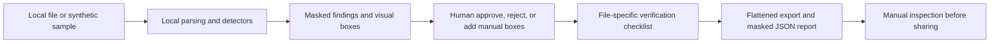

# RedactReady Local: Assistive pre-share privacy review

## Executive summary

RedactReady Local is a browser-based, local-first review workflow for PDFs, images, TXT, and CSV files. It helps a reviewer identify potentially sensitive content, confirm/reject findings, add manual boxes, complete a verification checklist, and export a flattened review copy plus an optional masked report.

**Technical implementation verified; external workflow outcome not yet validated.** It is an assistive review tool, not a guarantee of complete detection/redaction, legal advice, a compliance certification, or a substitute for human inspection.

## Problem, user, and workflow

The problem is that visual black boxes and unreviewed exports can leave searchable text, metadata, OCR layers, filenames, or pixels exposed. Intended users include privacy/security teams, knowledge workers, HR/people operations, research/education coordinators, and legal/support roles handling approved local material.

Inputs are a supported local file or the included synthetic samples. Decision points include which findings to approve, whether OCR is appropriate, whether a visual/manual box is required, and whether the exported file has passed the checklist. Outputs are a redacted copy, optional JSON report that omits raw sensitive values, and a reviewer decision—not an automatic clearance.

## Architecture, privacy, and security boundary

- React, TypeScript, Vite, Zustand, PDF.js, `pdf-lib`, Canvas, and local Tesseract assets support the browser workflow.
- Structured detectors cover common identifiers; custom terms and browser-native barcode/QR detection are supplementary. QR/barcode support depends on the browser API and is explicitly warned when unavailable.
- PDF export uses a newly rendered image-backed PDF; image export redraws pixels through canvas; text/CSV export replaces confirmed values with category labels.
- There is no backend upload route or telemetry in the documented workflow. OCR assets are served from the app's own `public/ocr` path. A deployment still needs network, console, runtime, and exported-file inspection before use with real information.
- Browser state and exports remain the reviewer's responsibility. The application cannot guarantee metadata sanitization, detection coverage, accessibility preservation in flattened PDFs, or the safety of a file after export.

## Human review, error handling, and failure modes

Findings display masked previews; the reviewer can approve, reject, or add manual boxes. Experimental OCR reports warnings and requires review. Unsupported browsers, unavailable barcode detection, incomplete PDFs, visual-only content, transformed layouts, hidden objects, and copy/paste behavior are all reasons to pause and inspect manually.

The practical failure mode is an incomplete redaction treated as complete. The mitigation is explicit: use synthetic/approved sanitized inputs, complete file-specific verification, open the export, inspect visible and selectable content/properties/filename, and do not share until a qualified human accepts the residual risk.

## David Turner and AI-assistance role

David Turner implemented the local-first privacy workflow, deterministic detector and export path, manual-review controls, verification framing, testable document-processing architecture, and accompanying release/documentation materials represented in this source tree. The verified workflow does not require a generative-AI provider. OCR is local, opt-in, experimental assistance; it must not be described as reliable automation or a complete visual-content detector.

## Testing and evidence

Executed in the isolated Portfolio clone on 2026-08-05:

| Command | Result | Evidence |
| --- | --- | --- |
| `npm run lint --workspace apps/redactready-local` | PASS with one toolchain warning | ESLint reports the tracked `.eslintignore` deprecation; no lint errors |
| `npm run test --workspace apps/redactready-local` | PASS, 13 tests | Detector, redaction/export/verification logic |
| `npm run build --workspace apps/redactready-local` | PASS | Production static build |
| `npm run e2e --workspace apps/redactready-local` | PASS, 2 browser runs | Same local text-fixture upload and redacted-preview assertion at desktop and iPhone-13-sized Chromium |

The browser assertion verifies the text fixture workflow and preview. It does not establish successful redaction of every PDF/image layout, OCR accuracy, metadata safety, public deployment behavior, or legal/compliance sufficiency.

## Maturity, limitations, and next validation

Maturity: **prepared for controlled evaluation with synthetic or approved sanitized files**. No independent accuracy, user, customer, productivity, compliance, or security result has been established. The canonical recorded static route is `https://ai-project-portfolio-redactready-lo.vercel.app/`; current public rendering and network behavior remain manual/provider verification work.

Next validation: execute the existing manual QA checklist with synthetic PDF/image/TXT/CSV samples, inspect all exports in a separate viewer, record browser network activity, and conduct keyboard/screen-reader/zoom checks. Do not use real sensitive material until that use is separately authorized and independently reviewed.

## Reviewer summary and screenshot plan

In 60 seconds, load a synthetic sample, inspect masked findings, make one deliberate approval/rejection/manual-box decision, show the checklist, export, and state that the export must be opened and manually inspected before sharing.

Capture only supplied synthetic samples: landing state, finding review, a manual visual box, checklist, export confirmation, and the separate exported-file inspection. Avoid all real personal, customer, employee, health, financial, credential, or regulated information.

## Evidence references

- [Application README](../../apps/redactready-local/README.md)
- [Security boundary](../../apps/redactready-local/SECURITY.md)
- [Limitations](../../apps/redactready-local/LIMITATIONS.md)
- [Manual QA checklist](../../apps/redactready-local/MANUAL_QA_CHECKLIST.md)
- [Browser workflow](../../apps/redactready-local/e2e/redact-text.spec.ts)
- [Prior portfolio case study](../../projects/redactready-local/CASE_STUDY.md)
